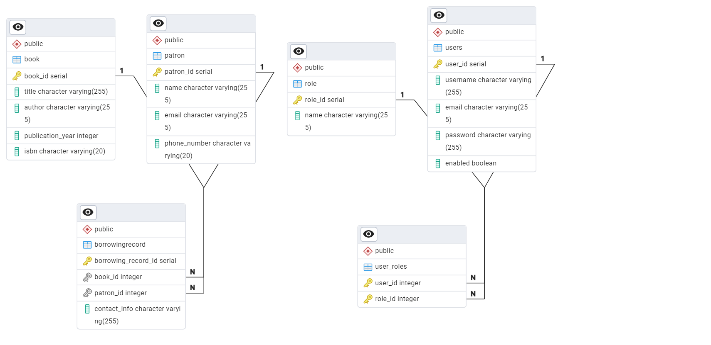

# Library Management System API Documentation

## Overview

This guide provides instructions for setting up, running, and interacting with the Library Management System API. The application uses Spring Boot and provides RESTful APIs for managing patrons, books, and borrowing records. The system is secured with JWT-based authentication.

## Prerequisites

1. **Java Development Kit (JDK)**: Version 8 or higher.
2. **Maven**: For managing dependencies and building the project.
3. **Spring Boot**: The project uses Spring Boot, which should be included in the project dependencies.
4. **PostgreSQL**: Database for storing application data.

## Setup and Run the Application

### Step 1: Clone the Repository

```bash
git clone <repository-url>
cd <repository-directory>
```

### Step 2: Configure the Database

- Update the `application.properties` file with your PostgreSQL database credentials:

  ```properties
  spring.datasource.url=jdbc:postgresql://localhost:5432/library_db
  spring.datasource.username=your_username
  spring.datasource.password=your_password
  spring.jpa.hibernate.ddl-auto=update
  spring.jpa.show-sql=true
  spring.jpa.properties.hibernate.dialect=org.hibernate.dialect.PostgreSQLDialect
  ```

### Step 3: Build and Run the Project

```bash
mvn clean install
mvn spring-boot:run
```

The application will be available at `http://localhost:8080`.

## Authentication

### Register a New User

- **Endpoint**: `/api/auth/register`
- **Method**: `POST`
- **Request Body**:
  - `username` (String): Desired username.
  - `password` (String): Desired password.
  - `role` (String): Role of the user (e.g., `ADMIN` or `USER`).

- **Response**:
  - `200 OK`: Returns a JWT token upon successful registration.

### Login

- **Endpoint**: `/api/auth/login`
- **Method**: `POST`
- **Request Body**: 
  - `username` (String): Registered username.
  - `password` (String): Password.
- **Response**:
  - `200 OK`: Returns a JWT token upon successful login.

### Using the JWT Token

After successful login or registration, you will receive a JWT token. Include this token in the `Authorization` header of your requests:

```http
Authorization: Bearer <your-token>
```

## API Endpoints

### Book Management

#### 1. Add a New Book

- **Endpoint**: `/api/books/add`
- **Method**: `POST`
- **Roles Required**: `ADMIN`
- **Parameters**:
  - `Book`: JSON object containing book details.
- **Response**:
  - `200 OK`: Book added successfully.
  - `400 Bad Request`: Book already exists.

#### 2. Update a Book

- **Endpoint**: `/api/books/update`
- **Method**: `POST`
- **Roles Required**: `ADMIN`
- **Parameters**:
  - `id` (Long): ID of the book to update.
  - `Book`: JSON object with updated book details.
- **Response**:
  - `200 OK`: Book updated successfully.
  - `400 Bad Request`: Book does not exist.

#### 3. Delete a Book

- **Endpoint**: `/api/books/delete`
- **Method**: `POST`
- **Roles Required**: `ADMIN`
- **Parameters**:
  - `id` (Long): ID of the book to delete.
- **Response**:
  - `200 OK`: Book deleted successfully.
  - `400 Bad Request`: Book does not exist.

#### 4. Get All Books

- **Endpoint**: `/api/books/getAll`
- **Method**: `POST`
- **Roles Required**: `ADMIN` or `USER`
- **Response**:
  - `200 OK`: Returns a list of all books.

#### 5. Get a Book by ID

- **Endpoint**: `/api/books/get`
- **Method**: `POST`
- **Roles Required**: `ADMIN` or `USER`
- **Parameters**:
  - `id` (Long): ID of the book.
- **Response**:
  - `200 OK`: Returns the book details.

### Patron Management

#### 1. Add a New Patron

- **Endpoint**: `/api/patrons/add`
- **Method**: `POST`
- **Roles Required**: `ADMIN`
- **Parameters**:
  - `Patron`: JSON object containing patron details.
- **Response**:
  - `200 OK`: Patron added successfully.
  - `400 Bad Request`: Patron already exists.

#### 2. Update a Patron

- **Endpoint**: `/api/patrons/update`
- **Method**: `POST`
- **Roles Required**: `ADMIN`
- **Parameters**:
  - `id` (Long): ID of the patron to update.
  - `Patron`: JSON object with updated patron details.
- **Response**:
  - `200 OK`: Patron updated successfully.
  - `400 Bad Request`: Patron does not exist.

#### 3. Delete a Patron

- **Endpoint**: `/api/patrons/delete`
- **Method**: `POST`
- **Roles Required**: `ADMIN`
- **Parameters**:
  - `id` (Long): ID of the patron to delete.
- **Response**:
  - `200 OK`: Patron deleted successfully.
  - `400 Bad Request`: Patron does not exist.

#### 4. Get All Patrons

- **Endpoint**: `/api/patrons/getall`
- **Method**: `GET`
- **Roles Required**: `ADMIN` or `USER`
- **Response**:
  - `200 OK`: Returns a list of all patrons.

#### 5. Get a Patron by ID

- **Endpoint**: `/api/patrons/get`
- **Method**: `GET`
- **Roles Required**: `ADMIN` or `USER`
- **Parameters**:
  - `id` (Long): ID of the patron.
- **Response**:
  - `200 OK`: Returns the patron details.

### Borrowing Record Management

#### 1. Borrow a Book

- **Endpoint**: `/api/borrowing-record/borrow-book`
- **Method**: `POST`
- **Roles Required**: `USER`
- **Parameters**:
  - `Book`: JSON object containing book details.
  - `Patron`: JSON object containing patron details.
- **Response**:
  - `200 OK`: Book borrowed successfully.
  - `400 Bad Request`: Book is not available.

#### 2. Return a Book

- **Endpoint**: `/api/borrowing-record/return-book`
- **Method**: `POST`
- **Roles Required**: `USER`
- **Parameters**:
  - `bookId` (Long): ID of the book to return.
  - `patronId` (Long): ID of the patron returning the book.
- **Response**:
  - `200 OK`: Book returned successfully.
  - `400 Bad Request`: Borrowing record not found.

### Database Structure

The Library Management System uses a PostgreSQL database to store information related to patrons, books, and borrowing records. The database schema is designed to efficiently manage and track library operations, ensuring data integrity and consistency.

#### Key Entities:

1. **Patron**:
   - Stores information about the library members, including their ID, name, and contact details.
   - This entity is linked to borrowing records to track which books a patron has borrowed.

2. **Book**:
   - Contains details of all the books available in the library, including title, author, ISBN, and availability status.
   - Books are linked to borrowing records to monitor their borrowing status.

3. **BorrowingRecord**:
   - Records the details of book loans, including which patron borrowed which book and the dates of borrowing and return.
   - This entity connects the `Patron` and `Book` entities.

### Database ERD (Entity-Relationship Diagram)

Below is the Entity-Relationship Diagram (ERD) that visually represents the database structure and the relationships between different entities.



This ERD provides a clear overview of the database schema, showing how data is organized and how different tables relate to each other. It serves as a valuable reference for understanding the database design and its implementation in the application.

## Conclusion

This documentation provides a detailed guide for running the Library Management System, interacting with its API endpoints, and using the authentication system. For further details, refer to the source code or contact Me.
